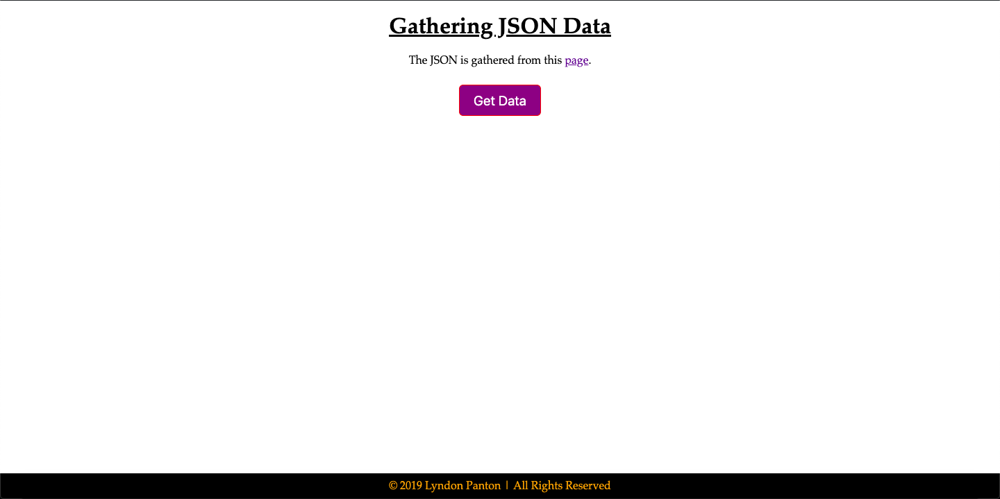
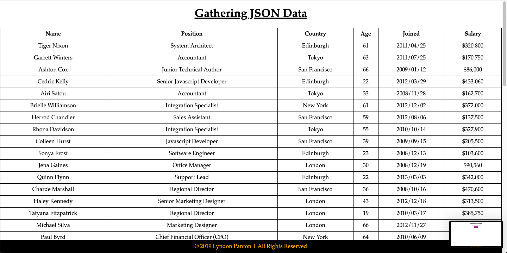
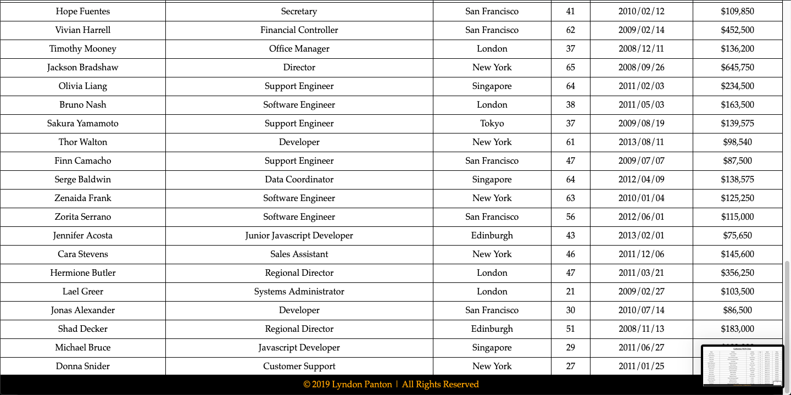

# Gathering JSON Data

## How To Open
> 1. Go to the project's download folder
> 2. Right click on the file named _index.html_
> 3. Choose the _open with_ option
> 4. Open the application in your desired browser

## How To Use
> 1. Click on the displayed button
> 2. The JSON data from the given URL will be diplayed in a table

## Requirements
> 1. This project requires a browser to run
> 2. The browser must have JavaScript available and enabled

## Extra Info
> 1. This project uses the _XMLHTTPRequest_ and the _HTML5 Table API_
> 2. This project was made for the w3c and Microsoft's *JavaScript Introduction* course in their *Front End Web Developer Program Certificate*

## Preview

